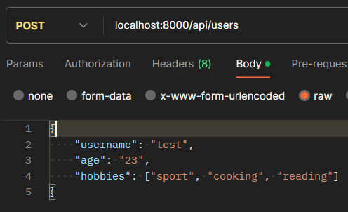

# Simple CRUD app

---

## Prerequisites
1. Install all modules using `npm install`
2. Run app using `npm run start` of `npm run "start:dev"` for development mode
3. In `.env` file set server's `PORT` number. Default - 3000

## Endpoints

### GET `/api/users`
* send empty query to get all users
* include `id` in params to get specific user. `id` must be number

### POST `/api/users`
* include body to add user. If required fileds were not passed - user will not be added
 

### PUT `/api/users`
* include `id` of user in params and body to modify user. Invalid or non-existing `id` will result in error

### DELETE `api/users`
* include param `id` to get specific user. `id` must be number

### Non-existing endpoint
* queries to non-existing endpoints will result in `404` with message `Endpoint not found`
